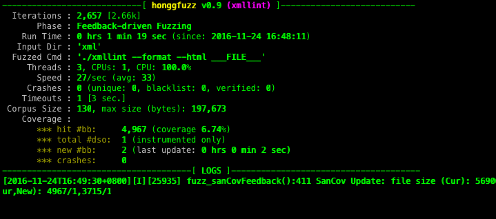

# riufuzz #

   

**2018-01-01 更新说明**
1. 更新运行时间格式
2. 使用 cdb 监控 windows 平台下的应用崩溃，并添加相应的设置脚本
3. 支持 macOS 10.13
4. 在 Dry Run 模式下增加剩余时间
5. 使用 "@@" 代替 "\_\_\_FILE\_\_\_"
6. 增加 "--monitor_sigabrt" 选项以支持忽略abort信号
7. Windows平台 Dry Run 模式下崩溃样本包含原始文件名
8. 更改 coverage 显示信息

**2017-09-15 更新说明**
1. 修复无样本后缀名的bug
2. 修复sprintf栈溢出漏洞
3. 修复cygwin下程序名提取的显示bug
4. 增加"Dry Run Mode"模式，用于验证漏洞，并不做文件变异处理
5. 变更界面高亮风格
6. 仅在漏洞被验证后才会发送邮件通知
7. 移植新版honggfuzz中的界面固定显示位置的功能
8. 更换安装目录，免去root权限安装
9. 添加Windows平台下基于cdb.exe的崩溃监控脚本

**2017-07-02 更新说明**
1. 修复cygwin下样本路径识别错误的问题
2. 支持中断后各线程退出
3. 显示输入的样本数
4. 去掉变异文件的隐藏性
5. 增加发现漏洞时的邮件通知（配置方法参见[《Mac OS X 下用命令行发送邮件》](https://my.oschina.net/uhziel/blog/186683)）

**2017-04-20 更新说明**

1. 增加字体格式分析脚本；
2. 增加 google 批量文件下载工具；
3. 添加 fuzzer 脚本；
4. 增加针对闭源程序的基于代码覆盖率的样本筛选工具；
5. 使用样本绝对路径，解决部分软件无法识别样本路径的问题；
6. 增加百度 pdf 批量下载脚本；
7. 修复 macOS 10.12.4 系统下的编译问题；
8. 添加 libarchiver fuzzer
9. 添加Windows GUI 程序崩溃监控

**2016-12-03 更新说明**

1. fix bug：保留后缀名的bug；
2. 增加显示最后一次新路径发现距离现在的时长；
3. 移植afl中的各种不同文件格式的字典文件，通过-w可直接传递使用
4. 添加`make install`安装命令
5. 精简CPU使用率的显示
6. 添加macOS系统下的fuzzing脚本

**2016-11-20 更新说明**

1. 修改显示内容，高亮标题，精简内容;
2. 增加`-e any`参数选项，以保持原始样本后缀，因为有些GUI程序有检测后缀名（默认为`.fuzz`）,设置后则允许同时fuzzing多种文件格式，比如图片格式;
3. fix bug: 增加Windows平台下的超时检测，若超时则自己关闭程序;
4. 修复`-C`代码覆盖率驱动导致无语料库输入则中断的bug，保证能生成sancov.map等文件;
5. 增加扩展fuzzer的功能，通过`-c`参数（原始功能无法使用，只会生成空文件导致程序中断）指定fuzzer文件名，默认传递样本（文件名为honggfuzz.*的格式），它会代替原有的fuzzer策略；
6. 当硬盘空间不足时，自动提醒并等待用户清理完毕后，输入`y`命令即可继续fuzzing。
7. 增加execvp执行结果检测，以匹配最新版macOS，虽无实际功能，但若不增加，有时可能会因此导致无法正常启动目标程序。

**Description**

  * A general-purpose, easy-to-use fuzzer with interesting analysis options. See [USAGE](https://github.com/google/honggfuzz/blob/master/docs/USAGE.md) for details
  * Supports several hardware-based (CPU) and software-based [feedback-driven fuzzing](https://github.com/google/honggfuzz/blob/master/docs/FeedbackDrivenFuzzing.md) methods
  * It works (at least) under GNU/Linux, FreeBSD, Mac OS X, Windows/CygWin and [Android](https://github.com/google/honggfuzz/blob/master/docs/Android.md)
  * Supports persistent modes of fuzzing (long-lived process calling a fuzzed API repeatedly) with libhfuzz
  * [Can fuzz standalone long-lasting processes](https://github.com/google/honggfuzz/blob/master/docs/AttachingToPid.md) (e.g. network servers like Apache's httpd and ISC's bind)

**Code**

  * Latest version: [0.8](https://github.com/google/honggfuzz/releases/tag/0.8)
  * [Changelog](https://github.com/google/honggfuzz/blob/master/CHANGELOG)

**Requirements**

  * **Linux** - The BFD library (libbfd-dev) and libunwind (libunwind-dev/libunwind8-dev)
  * **FreeBSD** - gmake
  * **Android** - Android SDK/NDK. Also see [this detailed doc](https://github.com/google/honggfuzz/blob/master/docs/Android.md) on how to build and run it
  * **Windows** - CygWin
  * if **Clang/LLVM** is used - the BlocksRuntime Library (libblocksruntime-dev)

**Trophies**

The tool has been used to find a few interesting security problems in major software packages; Examples:

  * FreeType 2:
   * [CVE-2010-2497](https://bugzilla.redhat.com/show_bug.cgi?id=CVE-2010-2497), [CVE-2010-2498](https://bugzilla.redhat.com/show_bug.cgi?id=CVE-2010-2498), [CVE-2010-2499](https://bugzilla.redhat.com/show_bug.cgi?id=CVE-2010-2499), [CVE-2010-2500](https://bugzilla.redhat.com/show_bug.cgi?id=CVE-2010-2500), [CVE-2010-2519](https://bugzilla.redhat.com/show_bug.cgi?id=CVE-2010-2519), [CVE-2010-2520](https://bugzilla.redhat.com/show_bug.cgi?id=CVE-2010-2520), [CVE-2010-2527](https://bugzilla.redhat.com/show_bug.cgi?id=CVE-2010-2527)
  * [Multiple bugs in the libtiff library](http://bugzilla.maptools.org/buglist.cgi?query_format=advanced;emailreporter1=1;email1=robert@swiecki.net;product=libtiff;emailtype1=substring)
  * [Multiple bugs in the librsvg library](https://bugzilla.gnome.org/buglist.cgi?query_format=advanced;emailreporter1=1;email1=robert%40swiecki.net;product=librsvg;emailtype1=substring)
  * [Multiple bugs in the poppler library](http://lists.freedesktop.org/archives/poppler/2010-November/006726.html)
  * [Multiple exploitable bugs in IDA-Pro](https://www.hex-rays.com/bugbounty.shtml)
  * [Use-after-free in OpenSSL - CVE-2016-6309](https://www.openssl.org/news/secadv/20160926.txt)
  * [Pre-auth crash in OpenSSH](https://anongit.mindrot.org/openssh.git/commit/?id=28652bca29046f62c7045e933e6b931de1d16737)
  * ... and more

**Other**

This is NOT an official Google product.
